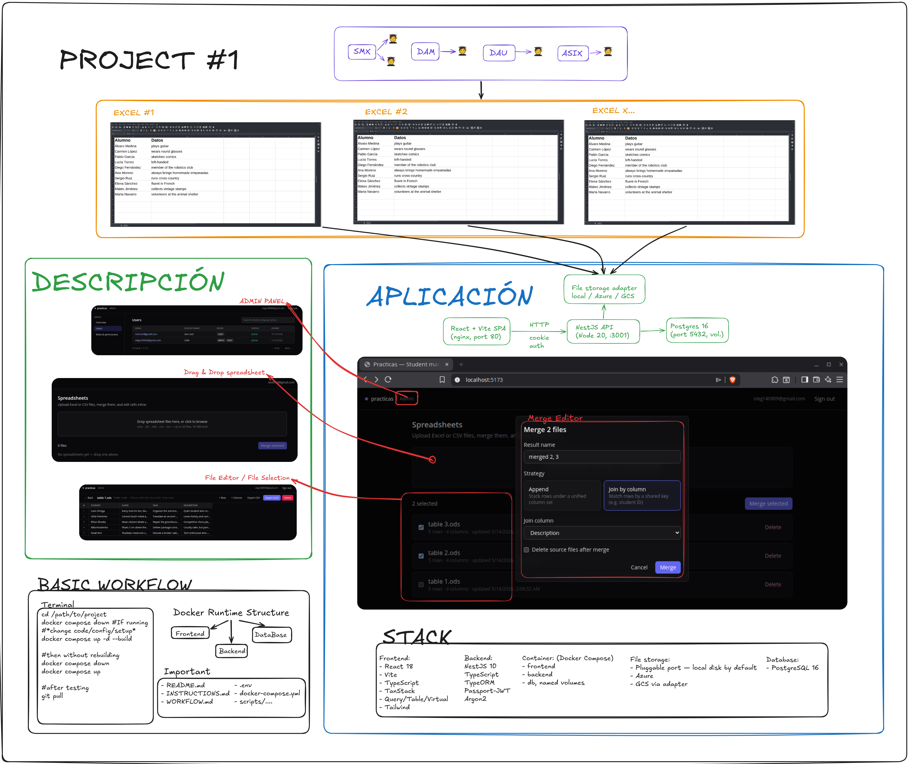

# Practicas — Student Manager

A self-hostable tool for tutors to manage students during *practicas* (internships / practical training). Upload Excel/CSV files, merge them, edit cells inline in a fast virtualised grid, export the result.



## Features

- **Upload** up to 20 spreadsheet files per request — `.xlsx`, `.xls`, `.ods`, `.csv`, `.tsv` / `.tab` — server-validated by magic bytes
- **Merge** multiple files using either append (stacked rows) or join-by-column (key-matched rows)
- **Edit** cells inline in a virtualised grid that stays smooth at hundreds of thousands of rows
- **Export** the merged/edited sheet back to XLSX or CSV
- **Auth & permissions** — email + password (Argon2id), JWT in httpOnly cookies, rotating refresh tokens, RBAC ready for OAuth swap
- **Admin panel** — at `/admin` for users with the `users:admin` permission: user list/search, role assignment, admin-initiated password reset, force-logout, soft-disable, delete, system stats
- **Containerised** — single `docker compose up` and the whole stack is running

## Tech stack

| Layer           | Choice                                                         |
|-----------------|----------------------------------------------------------------|
| Frontend        | React 18, Vite, TypeScript, TanStack Query/Table/Virtual, Tailwind |
| Backend         | NestJS 10, TypeScript, TypeORM, Passport-JWT, Argon2           |
| Database        | PostgreSQL 16                                                  |
| File storage    | Pluggable port — local disk by default, Azure Blob / GCS via adapter |
| Container       | Docker Compose (frontend, backend, db, named volumes)          |

## Quickstart

```bash
cp .env.example .env
# generate the JWT secrets:
sed -i "s|^JWT_ACCESS_SECRET=.*|JWT_ACCESS_SECRET=$(openssl rand -base64 64 | tr -d '\n')|"  .env
sed -i "s|^JWT_REFRESH_SECRET=.*|JWT_REFRESH_SECRET=$(openssl rand -base64 64 | tr -d '\n')|" .env
docker compose up --build
```

Open <http://localhost:5173>, register a tutor account, drop some spreadsheets.

## Documentation

- **[INSTRUCTIONS.md](INSTRUCTIONS.md)** — deployment guide for IT staff (Linux server, HTTPS, backups, troubleshooting)
- **[WORKFLOW.md](WORKFLOW.md)** — day-to-day workflow: dev vs prod modes, daily loop, adding features, releases, ops cadence
- **[DEVELOPMENT.md](DEVELOPMENT.md)** — deep dive on the code: architecture, request lifecycle, recipes, API & DB reference

## Project layout

```
spreadsheet-tool/
├── backend/                 NestJS API
│   ├── src/core/            ports + adapters + cross-cutting
│   ├── src/modules/         feature modules (auth, permissions, spreadsheets)
│   └── Dockerfile
├── frontend/                React + Vite SPA
│   ├── src/api/             typed fetch client
│   ├── src/auth/            session provider + route guards
│   ├── src/components/      Layout, grid, dialogs
│   ├── src/pages/           Dashboard, Login, Sheet, Register
│   ├── nginx.conf           static hosting + security headers
│   └── Dockerfile
├── db/init.sql              Postgres extensions
├── docker-compose.yml
└── .env.example
```

## License

This is a work-in-progress internal tool; pick a license before publishing externally.
